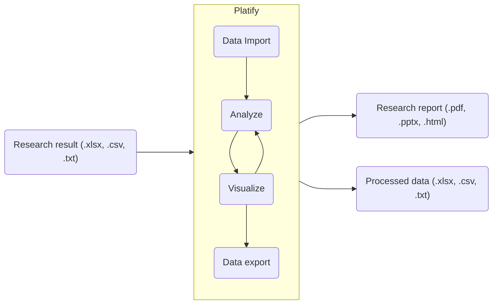

# Platify

This project aims to provide a clear communication between researchers and customers in drug discovery industry, by simplifying the process of research data import, analysis, visualization and export.

Take a look at a scheme below, which gives the overall purpose and workflow with this project:

## Installation

Temporally missing

## License

Distributed under MIT License, see LICENSE.

## Contributing

Have an idea for the project or found a bug? Feel free to open an issue, or better - create a PR, which are much appreciated.
